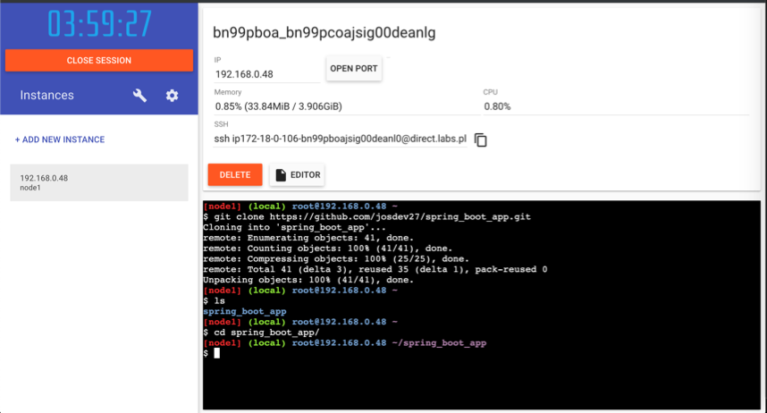
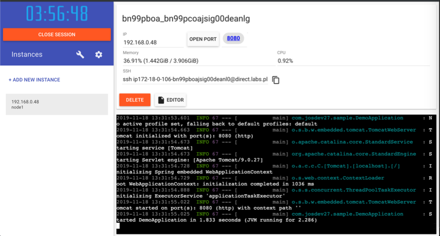

<p align="center">
    
</p>

# Lab 03 - Hello World en Spring Boot

<br/>

<p align="center">

<br/>
Welcome Spring!
</p>
<br/>

## Objetivos y resultados
El objetivo de este laboratorio es crear y levantar con Docker  un microservicio desarrollado in Java usando [Spring Boot](https://spring.io/projects/spring-boot). Al final de este laboratorio, tendremos una API con un endpoint **Get “/hello?name={name}”**. En los siguientes laboratorios, este microservicio será consumido por una aplicación Angular.

## Prerequisitos

El único prerequesito es tener una cuenta en Docker :).

## Levantar tu primera aplicación Spring Boot

### Introducción

El microservicio tiene un controlador con un único endpoint:

```sh
GET /demo/hello?name={name}
```

Este endopint recibe un parámetro “name” y devuelve el String Hello, {name}  con 200 OK como código HTTP:

```sh
GET /demo/hello?name=Docker
```

Y la respuesta:

```sh
Hello, Docker
```

### Clonar el repositorio

Tienes que clonar el proyecto desde [spring_boot_app](https://github.com/josdev27/spring_boot_app). Añadir una nueva instancia en play-with-docker y ejecutar:

```sh
git clone https://github.com/josdev27/spring_boot_app.git
```

En este momento, hemos generado el directorio **spring_boot_app** con el código fuente. El próximo paso es cambiarnos con el comando *cd*:

```sh
cd spring_boot_app
```

<p align="center">
    
</p>


### Construir y ejecutar el microservicio

El siguiente paso es ejecutar la aplicación para verificar que los pasos son correctos.. En la misma instancia ejecutamos:

```sh
docker run -p 8080:8080 -it --rm --name spring_boot_app -v "$(pwd)":/usr/src/mymaven -w /usr/src/mymaven maven:3.3-jdk-8 mvn spring-boot:run
```
•	run: permite lanzar una imagen de docker. En este caso,  maven:3.3-jdk-8 https://hub.docker.com/_/maven, que nos permite ejecutar maven para contruir y levantar nuestro microservicio.
•	-p: el formato es host_port:container_port. En este caso, el puerto 8080 de la máquina lo rederijimos al puerto 8080 del contenedor (por el que está escuchando el microservicio). 
•	--rm: Elimina el contenedor una vez ejecutado.
•	--name: le asignamos el nombre spring_boot_app al contenedor.
•	-v: nos permite asociar un directorio local a uno de docker (en nuestro caso el directorio actual a /usr/src/mymaven). De esta forma, docker tiene acceso al proyecto. Ejemplo: https://docs.docker.com/engine/reference/commandline/run/#mount-volume--v---read-only
•	-w: Asociar un directorio de trabajo. En este caso, /usr/src/mymaven
•	mvn spring-boot:run : nos permite lanzar contruir y ejecutar el microservicio con maven.


Para más información, mirar https://docs.docker.com/engine/reference/commandline/run/.

El proceso puede ser lento ya que tiene que descargar la imagen base (Take easy! ;))

Si todo es correcto, deberias de ver el siguiente mensaje en la terminal:


```sh
INFO 67 --- [           main] com.josdev27.sample.DemoApplication      : Started DemoApplication in 1.915 seconds (JVM running for 2.452)
```

<p align="center">
    
</p>

### Verificar que la aplicación está escuchando

Lo primero es añadir una nueva instancia, ya que en la otra tenemos levantada la consola del microservicio.  Para hacer la petición, vamos a utilizar el comando curl (the *ip-other-instance* es la IP de la otra instancia, en mi caso *192.168.0.48*):

```sh
curl -X GET http://<ip-other-instance>:8080/demo/hello\?name\=Jos
```

<p align="center">
    
</p>

Si todo va bien, veremos por la salida:

```sh
Hello, Jos
```

## Resumen
Hemos clonado una aplicación Spring Boot. La hemos construido y ejecutado usando maven dockerizado. Luego, hemos sido capaces de probar que nuestra aplicación está funcionando. Todo sin escribir una linea de código ;)

El siguiente paso será conectar está aplicación al frontend en Angular y a la capa de datos en PostgreSQL, todo ello en contenedores docker.


< [Lab 02](../lab-02/Readme.md) | [Lab 03 - Frontend - Haciendo el despliegue de un HelloWorld con Docker y Nginx ](../../lab-03)>

<p align="center">
    
</p>

