<p align="center">
    
</p>

# Lab 03.A - Hello World in Spring Boot

<br/>

<p align="center">

<br/>
Welcome Spring!
</p>
<br/>

## Goals and results
The goal of this laboratory is create a microservice in Java using [Spring Boot](https://spring.io/projects/spring-boot). Finally, we will have an API with a endpoint **Get /hello?name={name}**  

<br/>

## Prerequisites

Before start to coding, we need install some tools:

1. [**Java 8** or mayor](#how-to-install-java-8)

2. [**Maven 3**]()

3. [**Eclipse Java Enterprise**]()
   1. [**Spring Tools 4 - for Spring Boot**]()

<br/>

### How to install Java 8

You can use Oracle JDK, in that case, you have register in Oracle, or use OpenJDK, the open version of JDK (that we will use).


#### Check if we already have Java

We can check if we have installed java with the next command:

```sh
java -version
```

If you see a message similar to *version "1.x"*, where *x* is mayor or equal to 8, skip this section and go to [Install maven 3](#how-to-install-maven-3).

If we see a message similar to *Command not found*, we need install java, so go to [Install Java 8](#install-java-8).


<p align="center">
    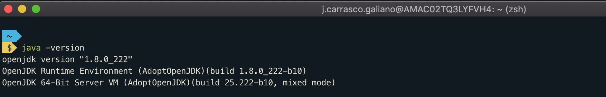
    In my case, I use OpenJDK 1.8.0_222
</p>

#### Install Java 8

#### Windows

1. Download OpenJDK 8 from next link: https://adoptopenjdk.net/
2. Extract the zip in the folder you want.
3. Set the value for **JAVA_HOME**. For that, open cmd and execute next command:

    ```cmd
    setx /m JAVA_HOME "<full_path_your_folder>"
    ```

4. Execute *java -version* to verify the installation.

### Mac

1. Download OpenJDK 8 from next link: https://adoptopenjdk.net/
2. Extract the zip in the folder you want.
3. Set the value for **JAVA_HOME**. For that, open terminal and execute next command:

    ```sh
     export JAVA_HOME="<full_path_your_folder>"
    ```

4. Execute *java -version* to verify the installation.

### Linux

1. Open a terminal.
2. Execute the next command:

   ```sh
    sudo apt-get install openjdk-8-jdk
   ```

3. Execute *java -version* to verify the installation.

<br/>

### How to install maven 3

You can check if you have already maven 3 installed:

```sh
mvn --version
```

<p align="center">
    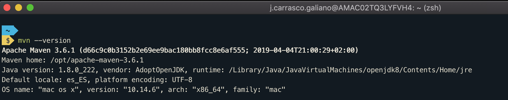
    In my case, I have Maven 3.6.1
</p>

#### Windows

1. Download maven from next link: https://maven.apache.org/download.cgi
2. Extract the file downloaded.
3. Add *<your_maven_directory\bin>* to PATH:
   1. Press *WinKey + Pause*
   2. Select the *Advanced tab*
   3. Click on *Environment Variables* button
   4. Adding or selecting the *PATH variable* in the user variables with the value **<your_maven_directory\bin>**.

#### Mac and Linux

1. Download maven from next link: https://maven.apache.org/download.cgi
2. Extract the file downloaded.
3. Add pache-maven-3.6.2\bin to PATH. Open a terminal and execute:

   ```sh
   export PATH=<your_maven_directory\bin>:$PATH
   ```

More info in https://maven.apache.org/install.html.

### How to install Eclipse Enterprise

The process is very similar in Windows, Mac and Linux.

#### Install Eclipse

1. Download Eclipse from https://www.eclipse.org/downloads/
   
   <p align="center">
    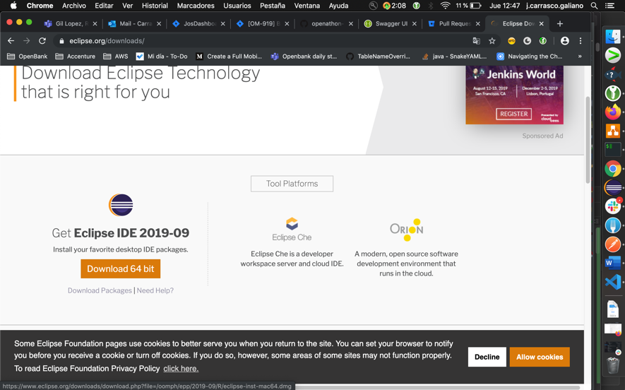
</p>

2. Execute the installer and select **Eclipse IDE for Java EE developers**

<p align="center">
    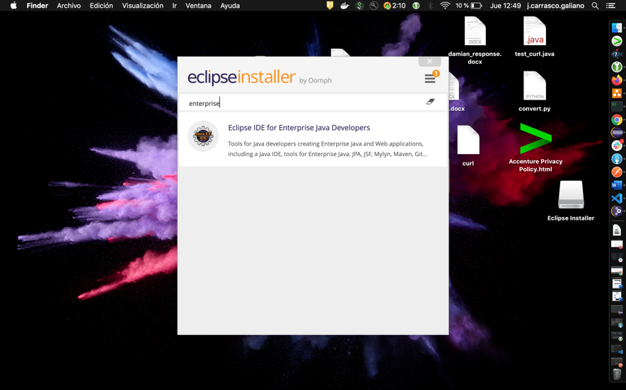
</p>

#### Install Spring Boot Plugin

1. Open Eclipse
2. Click in *Help > Eclipse Marketplace...*
   
   <p align="center">
    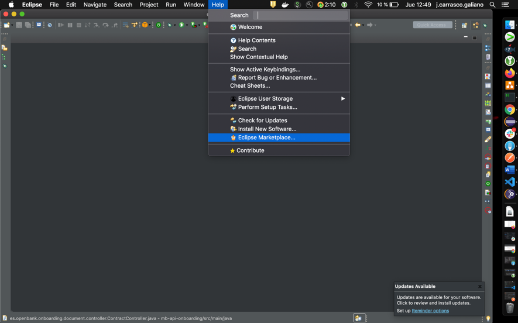
    </p>

   1. In the search bar, we type *spring boot*
   2. Click *Install* in *Spring Tools 4*

    <p align="center">
    
    </p>


<br/>

## Create a new Spring Boot Application

For creating a basic Spring Boot Application, we will use https://start.spring.io/ through the eclipse Wizard:

1. Open Eclipse.
2. Click in *File > New > Other...*
   
   <p align="center">
    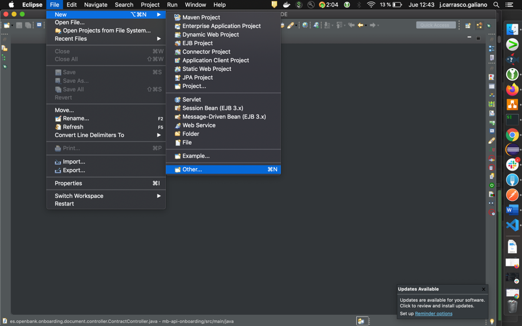
</p>

3. In the search bar, type *Spring*.
4. Click in *Spring Starter Project* and *Next*.
   
   <p align="center">
    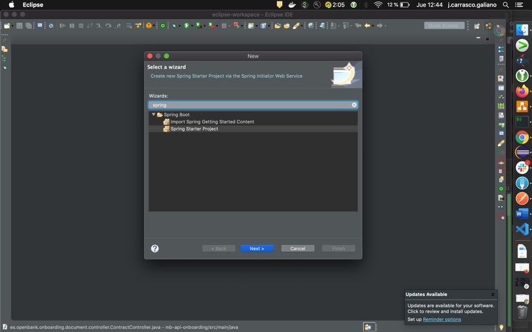
</p>

5. In *Name*, the name of your project and *Click in Next*.

<p align="center">
    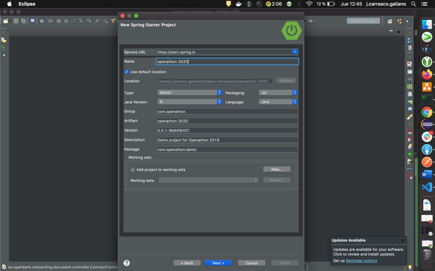
</p>

6. In the search bar, we type *Spring Web* and select it. This is the basic dependency for any Spring boot project.
7. Click in Finish.

<p align="center">
    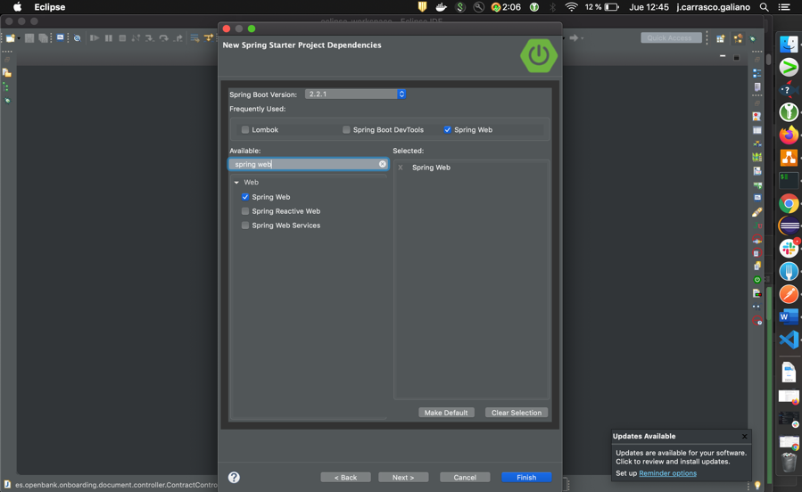
</p>

## Struct the project

Initially, the project have:

1. **DemoApplication.java** : The main class of our application
2. **application.properties**: The file where we can define the properties of our application
3. **pom.xml**: The file that describe our application (name, artifact, dependencies, etc)
   
<p align="center">
    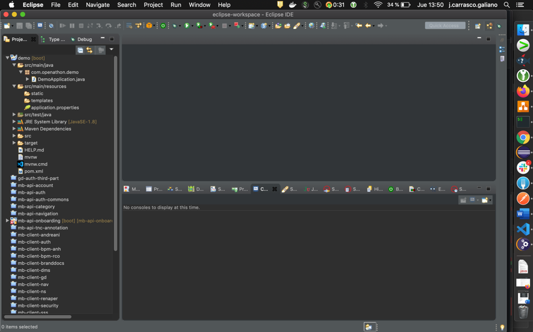
</p>

We will struct the project defining two package:

1. **controller**: contains the controller of our application

2. **service**: contains the services interfaces of our application
    **impl**: contains the implementations of services.

To create the packages:

1. Right click in the parent package (com.openathon.demo in this example).
2. Select *New*
3. Select *Package*
    <p align="center">
    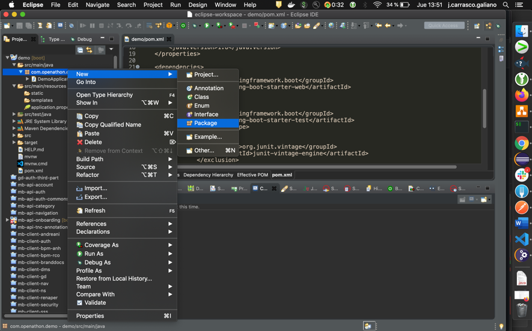
    </p>

4. In the name, we append *controller*
    <p align="center">
    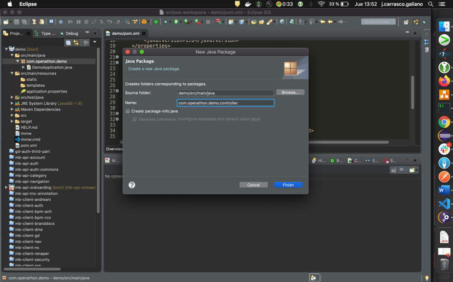
    </p>


The result would be the next:

<p align="center">
    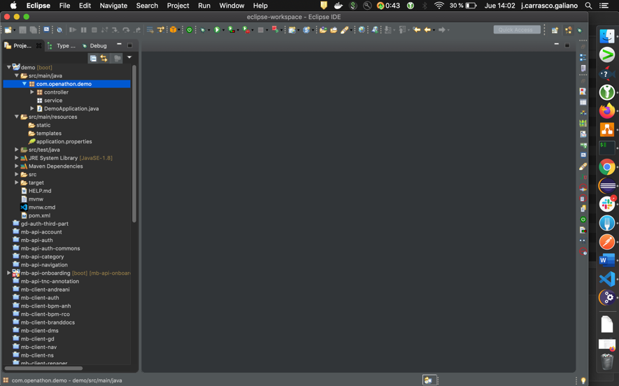
</p>

## Add a new Controller

In the controller package, we have to create a Class:

<p align="center">
    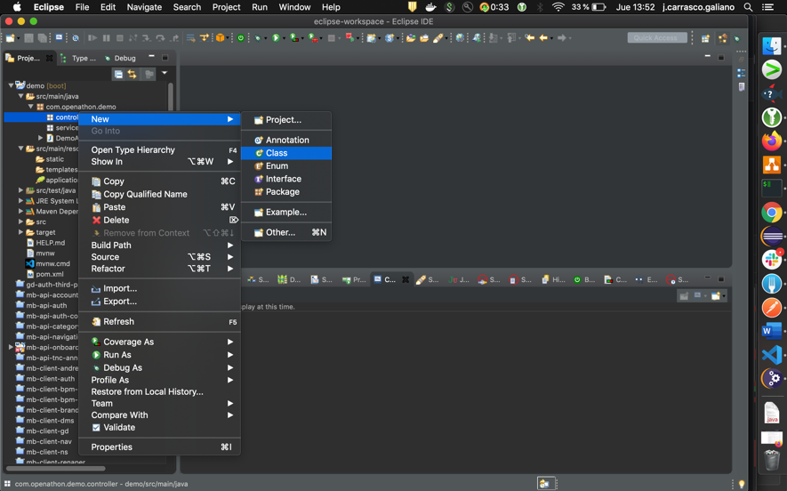
</p>

We type the name of the class (in this example, DemoController)

<p align="center">
    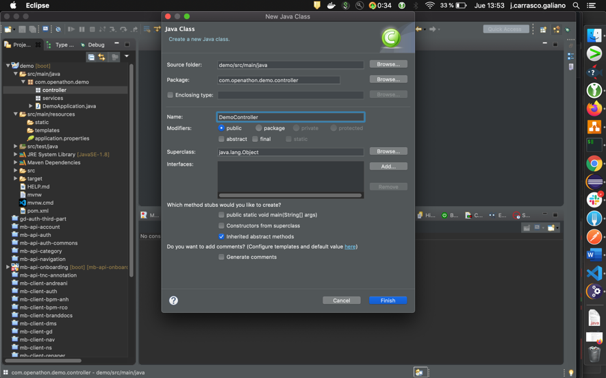
</p>

In this point we have two packages and one class.
To indicate that this class is a controller, we have to add **@RestController** annotation. Also, we add **@RequestMapping** annotation, to indicate the path of the URL (demo) and the type of the response (JSON)

<p align="center">
    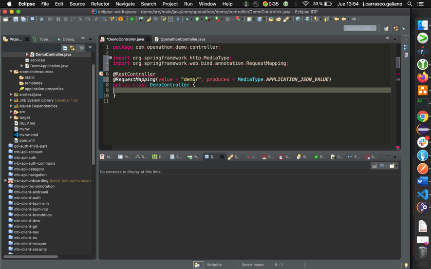
    To resolve the imports, Crtl + Shift + O
</p>

The controller would be the next:

```java
package com.openathon.demo.controller;

import org.springframework.http.MediaType;
import org.springframework.web.bind.annotation.RequestMapping;
import org.springframework.web.bind.annotation.RestController;

@RestController
@RequestMapping(value = "demo", produces = MediaType.APPLICATION_JSON_VALUE)
public class DemoController {

}
```

After, we will add the next method:

```java
    @GetMapping(value = "/hello")
    public ResponseEntity<String> getHello(@RequestParam("name") String name) {
        return ResponseEntity.ok().body("Hello, " + name);
    }
```

**@GetMapping** indicate that is a GET with path hello. It is a method that return a String, with 200 OK as HTTP Code, and receive a request param “name”. I mean, the request would be:

```sh
GET /demo/hello?name={name}
```

And the response:

```sh
Hello, {name}
```

In this time, we will run the application to verify it. 
We can this by two ways:

##### **In Eclipse:**
   1. Right click in the project.
   2. Click Run As
   3. Click Spring Boot App
    <p align="center">
    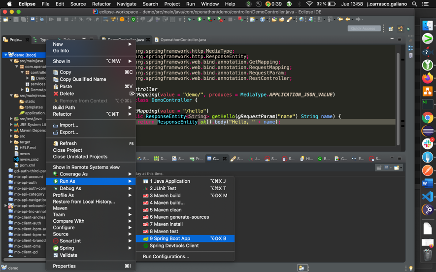
</p>

##### **In terminal:**
   1. Open a terminal and execute the next:

   ```sh
   mvn spring-boot:run
   ```

In both ways, you can see **Started DemoApplication** in the last line of the log to verify the application was started.

<p align="center">
    
</p>

In a browser, type http://localhost:8080/demo/hello?name=Docker. You should see something similar to next image:

<p align="center">
    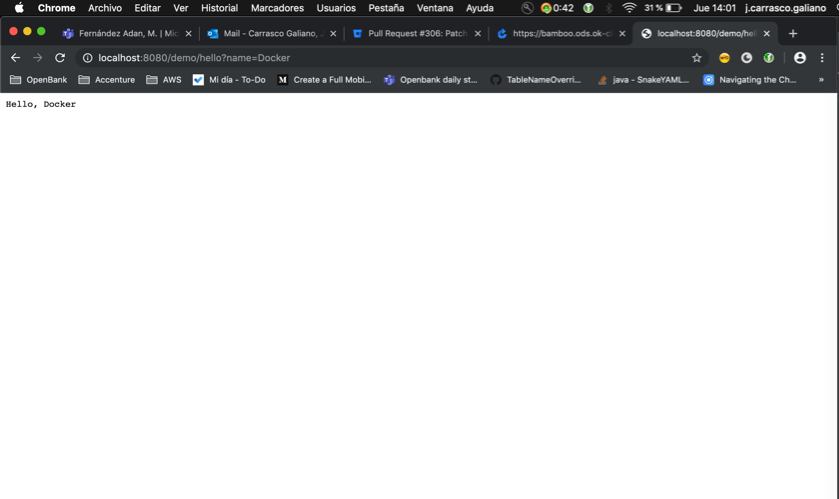
</p>

## Add a new Service

In this time, we have to add a class in the *service package*:

<p align="center">
    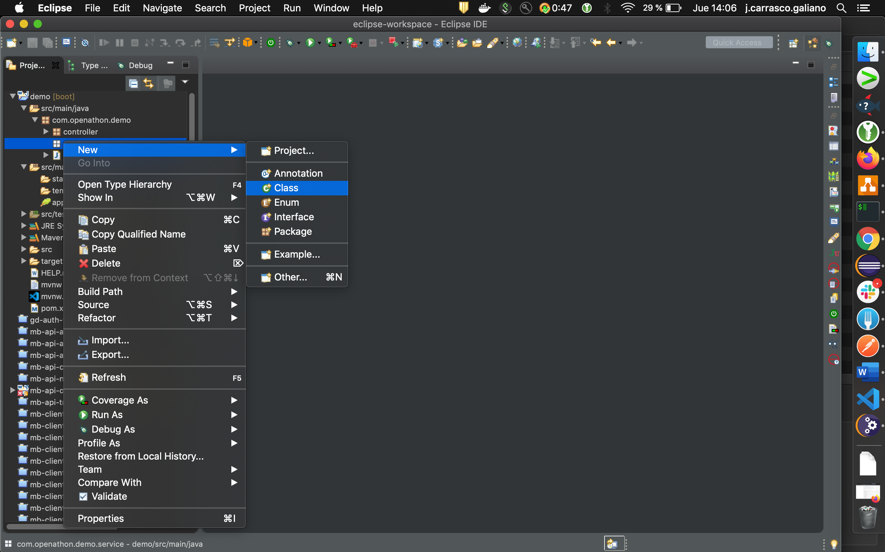
</p>

The name of the class would be **DemoServiceImpl**:

```java
import org.springframework.stereotype.Service;

@Service
public class DemoServiceImpl {

}
```

You can see, like in the controller, we have added **@Service** annotation to indicate that this class is a *service*.

In the next step, we have to create a subpackage of *service*, with the name **impl**:

<p align="center">
    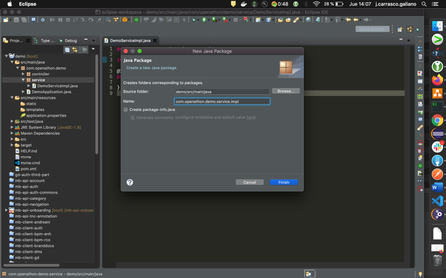
</p>

This package will have the implementations of the services of our application. So, in the package *service*, will be the interfaces. We have to add **DemoService** interface:

<p align="center">
    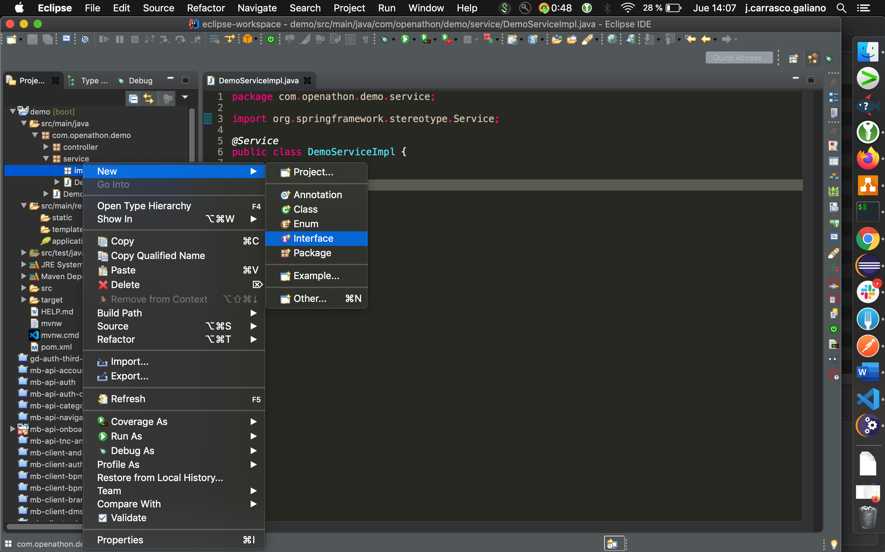
</p>
<p align="center">
    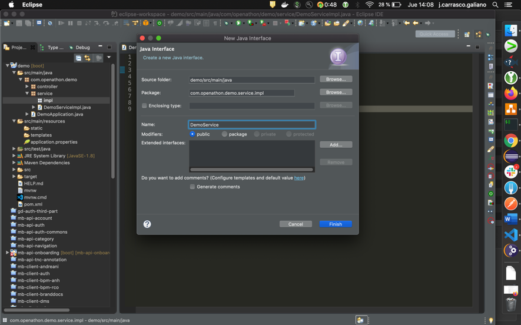
</p>

The interface would be the next:

```java
public interface DemoService {

    public String getHello(String name);
    
}
```

As you see, It has a simple method **getHello**.
The implementation will be in *DemoServiceImpl* class:


```java
import org.springframework.stereotype.Service;

import com.openathon.demo.service.impl.DemoService;

@Service
public class DemoServiceImpl implements DemoService {

    @Override
    public String getHello(String name) {
        return "Hello, "+ name;
    }

}
```

The method return **Hello, {name}**.

We run the application to verify the new changes:

<p align="center">
    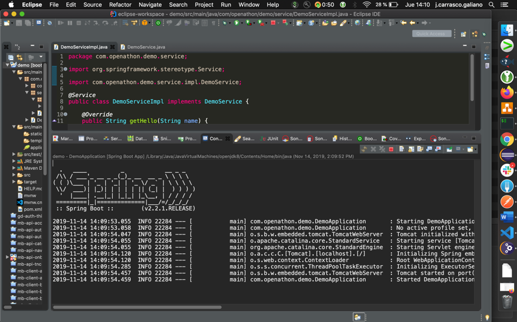
</p>

## Hello Jos!

The last step is connect the controller with the service that we created:

```java 
public class DemoController {

    @Autowired
    private DemoService demoService;
    
    @GetMapping(value = "/hello")
    public ResponseEntity<String> getHello(@RequestParam("name") String name) {
        return ResponseEntity.ok().body(demoService.getHello(name));
    }
    
}
```

We use **@Autowired** annotation, to use DemoService in the controller. The next difference is that the call to *getHello* method of the service to obtain the message:

```java
return ResponseEntity.ok().body(demoService.getHello(name))
```

If you start up the application, you will have your first Spring Boot Application. Congratulations! :)

<p align="center">
    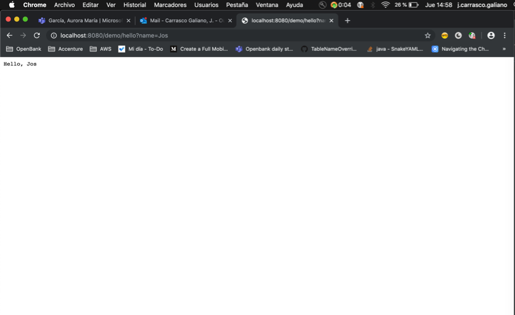
</p>

<br/>

[< Lab 03 - Creando un HelloWorld ](../../lab-03)>

<p align="center">
    
</p>

