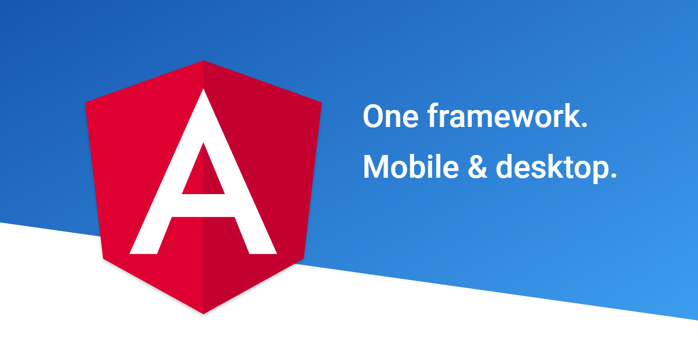
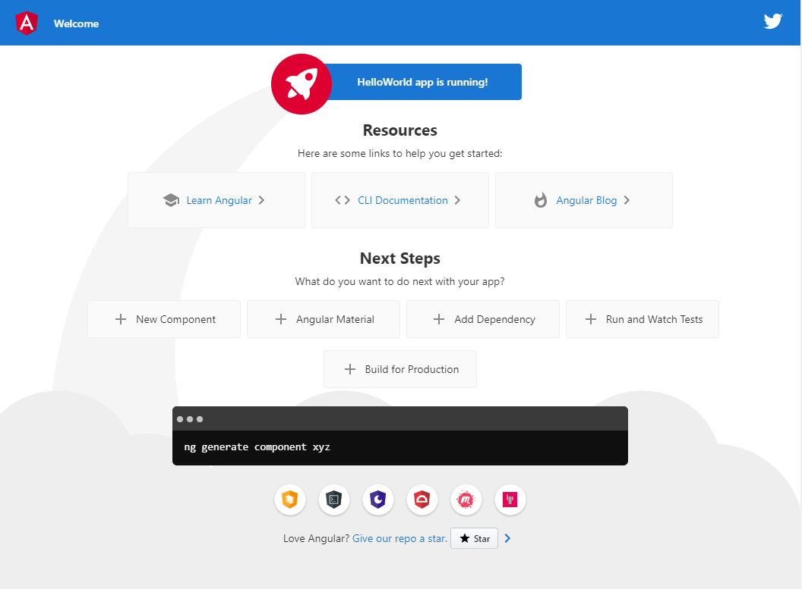
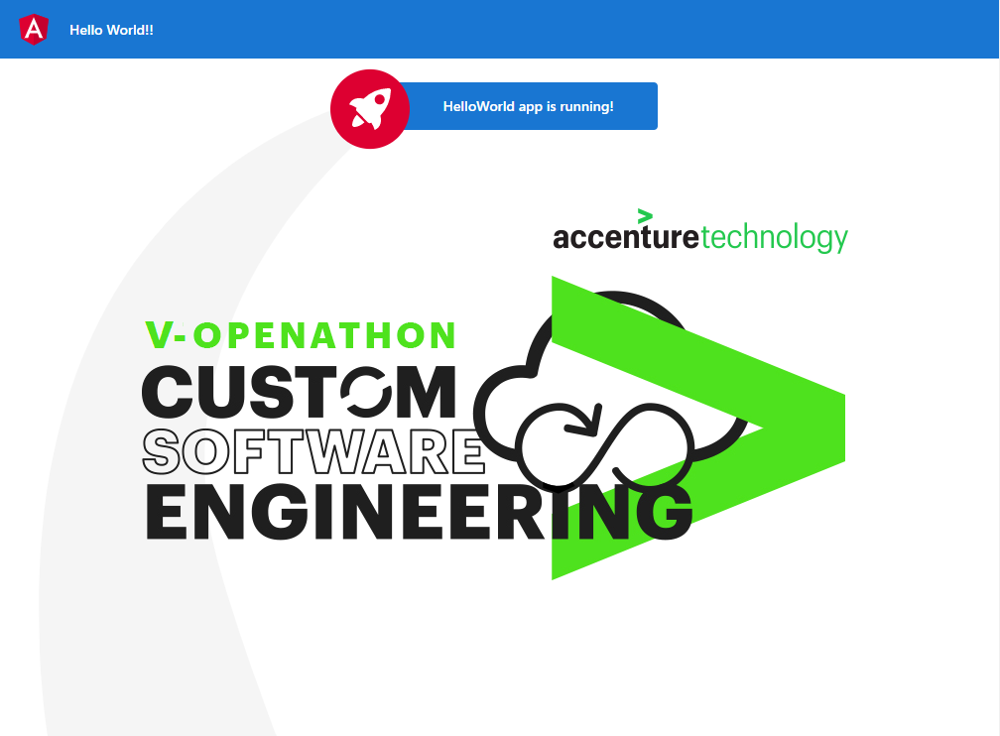

<p align="center">
    
</p>

# Lab 03.B - Creando un HolaMundo con Angular 
<br/>
<p align="center">

<br/>
¡Creemos una aplicación web simple usando Angular!
</p>
<br/>

## Objetivos y resultados
El objetivo de este laboratorio es crear una aplicación web simple, **desde cero**, que más adelante nos sirva como ejemplo de un desarrollo que podemos incluir en una imagen Docker. Para ello usaremos **Angular** y como resultado obtendremos un proyecto a partir del cual podremos generar la aplicación lista para ser publicada en cualquier servidor web.

Si quieres saber más sobre el desarrollo de aplicaciones con **Angular** puedes revisar el material utilizado en la  **[Openathon IV](https://github.com/Accenture/openathon-2019-angular)**.

<br/>

### Paso 1. Instalar Visual Studio Code.


Lo primiero que vamos a necesitar para hacer la aplicación con máxima facilidad es un buen editor de código. En principio nos debe valer cualquiera, pero os recomendamos **Microsoft Visual Studio Code**. Si aún no lo tienes instalado puedes descargarlo [aquí](https://code.visualstudio.com/).

<br/>

### Paso 2. Instalar Node.js


**Node.js** es un entorno en tiempo de ejecución multiplataforma, de código abierto, para la capa del servidor (pero no limitándose a ello) basado en el lenguaje de programación ECMAScript, asíncrono, con I/O de datos en una arquitectura orientada a eventos y basado en el motor V8 de Google. Fue creado con el enfoque de ser útil en la creación de programas de red altamente escalables, como por ejemplo, servidores web. Al contrario que la mayoría del código JavaScript, no se ejecuta en un navegador, sino en el servidor. 

Puedes descargar e instalar Node.js desde [aquí](https://nodejs.org/en/download/)

> **Recomendamos usar la versión TLS**

Esta instalación también instalará **npm**, el administrador de paquetes para **Node.js** y el registro de software más grande del mundo.

<br/>

### Paso 3. Instalar Angular CLI.


Abre tu terminal preferido y ejecuta el siguiente comando:

```sh
npm install -g @angular/cli
```

**Angular CLI** es una herramienta para inicializar, desarrollar, construir y mantener aplicaciones **Angular**.
[Click here](https://cli.angular.io/) para saber más.
    
> Dependiendo de tu ordenador y del sistema operativo, algunas dependencias no se instalarán y puede mostrar advertencias durante el proceso de instalación. Tras la instalación, ejecuta el siguiente comando:
> ```sh
> ng v
> ```
> Si todo ha ido bien, se mostrará una lista de versiones de Angular CLI y Node.js.

<br/>

### Paso 4. Crear un proyecto nuevo.

Desde la consola, situate en la carpeta en la que quieras crear el proyecto y ejecuta tu primer comando **Angular CLI** con **ng**:

```sh
ng new HelloWorld
Would you like to add Angular routing? (y/N) N
```

- **ng** es el comando **Angular Cli**. 
- **new** indica que queremos crear un proyecto nuevo
- **HelloWorld** es el nombre que le hemos dado al proyecto.

Cuando el comando finalice se habrá creado una nueva carpta llamada **HelloWorld** que contiene el proyecto recién creado. 

<br/>

### Paso 5. Ejecutar el proyecto recién creado

Abre **Visual Studio Code**. En el menú **File / Open Folder ...**, navegua a la carpeta **HelloWorld**, selecciona la carpeta y ábrela. Puedes echar un vistazo en su interior para ver como está estructurado el proyecto y cual es su contenido inicial. 

Sin tocar ni una línea de código, vamos a ejecutar directamente el proyecto creado por **Angular CLI**. Abre una consola / terminal o incluso mejor, abre el terminal integrado de **Visual Studio Code** y escribe:

```sh
ng serve
```

Sí todo ha ido bien, el servidor local de desarrollo que incluy **Angular CLI** nos publicará una página de bienvenida en [http://localhost:4200](http://localhost:4200) donde podremos ver lo siguiente: 

<p align="center">
    
</p>

<br/>

### Paso 5. Modificar el projecto para hacer nuestro "Hola Mundo!!".

Aunque en este momento el proyecto ya tiene buen aspecto, vamos a modificarlo un poco para practicar. Nuestro objetivo sera modificar la página de bienvenida para que muestre en el centro el logo de la **Openathon V**. También modificaremos ligeramente la barra superior para cambiar el texto "Welcome" por "Hello World!! y eliminar el logo de Twitter.

<br/>

#### Paso 5.1. Copiar la imagen del logo.

Descarga [esta](./HelloWorld/src/assets/img/Logo_OpenathonV.png) imagen y grábala en *src/assets/img*.

<br/>

#### Paso 5.2. Editar el código HTML.

Los **componentes** son el bloque de construcción más básico de una aplicación Angular. Una aplicación Angular contiene un árbol de **componentes** contenidos unos dentro de otros y que son los responsables de mostrar una determinada región de una determinada página de la aplicación. Cada componente, por lo general se compone de al menos estos tres ficheros:

  - *Fichero .html*: Contiene el fragmento de código HTML necesario para que el componente se renderice.
  - *Fichero .css o scss*: Contiene el fragmento de código CSS necesario para que el componente se renderice.
  - *Fichero .ts*: Contiene parte del código TypeScript con la lógica necesaria para el componente.

Nuestro proyecto actuamente solo contiene un componente que es el único responsable de mostrar por completo la pagina de bienvenida, así que para editar el HTML de la página tendremos que editar el fichero .html de este componente. Abriremos el fichero *src/app/app.component.html* y sustituiremos su contenido por el siguiente:

```typescript

<!-- Toolbar -->
<div class="toolbar" role="banner">
  
  <span>Hello World!!</span>
</div>

<div class="content" role="main">

  <!-- Highlight Card -->
  <div class="card highlight-card card-small">

    <svg id="rocket" alt="Rocket Ship" xmlns="http://www.w3.org/2000/svg" width="101.678" height="101.678" viewBox="0 0 101.678 101.678">
      <g id="Group_83" data-name="Group 83" transform="translate(-141 -696)">
        <circle id="Ellipse_8" data-name="Ellipse 8" cx="50.839" cy="50.839" r="50.839" transform="translate(141 696)" fill="#dd0031"/>
        <g id="Group_47" data-name="Group 47" transform="translate(165.185 720.185)">
          <path id="Path_33" data-name="Path 33" d="M3.4,42.615a3.084,3.084,0,0,0,3.553,3.553,21.419,21.419,0,0,0,12.215-6.107L9.511,30.4A21.419,21.419,0,0,0,3.4,42.615Z" transform="translate(0.371 3.363)" fill="#fff"/>
          <path id="Path_34" data-name="Path 34" d="M53.3,3.221A3.09,3.09,0,0,0,50.081,0,48.227,48.227,0,0,0,18.322,13.437c-6-1.666-14.991-1.221-18.322,7.218A33.892,33.892,0,0,1,9.439,25.1l-.333.666a3.013,3.013,0,0,0,.555,3.553L23.985,43.641a2.9,2.9,0,0,0,3.553.555l.666-.333A33.892,33.892,0,0,1,32.647,53.3c8.55-3.664,8.884-12.326,7.218-18.322A48.227,48.227,0,0,0,53.3,3.221ZM34.424,9.772a6.439,6.439,0,1,1,9.106,9.106,6.368,6.368,0,0,1-9.106,0A6.467,6.467,0,0,1,34.424,9.772Z" transform="translate(0 0.005)" fill="#fff"/>
        </g>
      </g>
    </svg>

    <span>{{ title }} app is running!</span>

    <svg id="rocket-smoke" alt="Rocket Ship Smoke" xmlns="http://www.w3.org/2000/svg" width="516.119" height="1083.632" viewBox="0 0 516.119 1083.632">
      <path id="Path_40" data-name="Path 40" d="M644.6,141S143.02,215.537,147.049,870.207s342.774,201.755,342.774,201.755S404.659,847.213,388.815,762.2c-27.116-145.51-11.551-384.124,271.9-609.1C671.15,139.365,644.6,141,644.6,141Z" transform="translate(-147.025 -140.939)" fill="#f5f5f5"/>
    </svg>
  </div>

  <div>
    
  </div>

</div>

```

<br/>

#### Paso 5.3. Editar el código CSS.

Ahora debemos modificar el fichero .css para que se adapte a los cambios realizados en el fichero .html. Para ello vamos a abrir el fichero *src/app/app.component.css* y cambiar su contenido por el siguiente:

```css
:host {
    font-family: -apple-system, BlinkMacSystemFont, "Segoe UI", Roboto, Helvetica, Arial, sans-serif, "Apple Color Emoji", "Segoe UI Emoji", "Segoe UI Symbol";
    font-size: 14px;
    color: #333;
    box-sizing: border-box;
    -webkit-font-smoothing: antialiased;
    -moz-osx-font-smoothing: grayscale;
  }

  h1,
  h2,
  h3,
  h4,
  h5,
  h6 {
    margin: 8px 0;
  }

  p {
    margin: 0;
  }

  .spacer {
    flex: 1;
  }

  .toolbar {
    height: 60px;
    margin: -8px;
    display: flex;
    align-items: center;
    background-color: #1976d2;
    color: white;
    font-weight: 600;
  }

  .toolbar img {
    margin: 0 16px;
  }

  .content {
    display: flex;
    margin: 32px auto;
    padding: 0 16px;
    max-width: 960px;
    flex-direction: column;
    align-items: center;
  }

  .card-container {
    display: flex;
    flex-wrap: wrap;
    justify-content: center;
    margin-top: 16px;
  }

  .card {
    border-radius: 4px;
    border: 1px solid #eee;
    background-color: #fafafa;
    height: 40px;
    width: 200px;
    margin: 0 8px 16px;
    padding: 16px;
    display: flex;
    flex-direction: row;
    justify-content: center;
    align-items: center;
    transition: all 0.2s ease-in-out;
    line-height: 24px;
  }

  .card-container .card:not(:last-child) {
    margin-right: 0;
  }

  .card.card-small {
    height: 16px;
    width: 168px;
  }

  .card-container .card:not(.highlight-card) {
    cursor: pointer;
  }

  .card-container .card:not(.highlight-card):hover {
    transform: translateY(-3px);
    box-shadow: 0 4px 17px rgba(black, 0.35);
  }

  .card.highlight-card {
    background-color: #1976d2;
    color: white;
    font-weight: 600;
    border: none;
    width: auto;
    min-width: 30%;
    position: relative;
  }

  .card.card.highlight-card span {
    margin-left: 60px;
  }

  svg#rocket {
    width: 80px;
    position: absolute;
    left: -10px;
    top: -24px;
  }

  svg#rocket-smoke {
    height: 100vh;
    position: absolute;
    top: 10px;
    right: 180px;
    z-index: -10;
  }

  a,
  a:visited,
  a:hover {
    color: #1976d2;
    text-decoration: none;
  }

  a:hover {
    color: #125699;
  }

  .circle-link {
    height: 40px;
    width: 40px;
    border-radius: 40px;
    margin: 8px;
    background-color: white;
    border: 1px solid #eeeeee;
    display: flex;
    justify-content: center;
    align-items: center;
    cursor: pointer;
    box-shadow: 0 1px 3px rgba(0, 0, 0, 0.12), 0 1px 2px rgba(0, 0, 0, 0.24);
    transition: 1s ease-out;
  }

  .circle-link:hover {
    transform: translateY(-0.25rem);
    box-shadow: 0px 3px 15px rgba(0, 0, 0, 0.2);
  }

  /* Responsive Styles */
  @media screen and (max-width: 767px) {

    .card-container > *:not(.circle-link) ,
    .terminal {
      width: 100%;
    }

    .card:not(.highlight-card) {
      height: 16px;
      margin: 8px 0;
    }

    .card.highlight-card span {
      margin-left: 72px;
    }

    svg#rocket-smoke {
      right: 120px;
      transform: rotate(-5deg);
    }
  }

  @media screen and (max-width: 575px) {
    svg#rocket-smoke {
      display: none;
      visibility: hidden;
    }
  }
```

<br/>

#### Paso 5.4. Verificar los cambios.

Si aún tenemos en ejecución el comando **ng serve** que habíamos ejecutado anteriormente, podremos verificar que la página de bienvenida original se ha refrescado automáticamente y ya muestra los cambios que hemos realizado. El resultado final debe ser este:

<p align="center">
    
</p>

<br/>

### Paso 6. Generar el entregable del proyecto

Ahora que hemos realizado todos los cambios que queríamos, vamos a generar el entregable de nuestra web listo para ser desplegado en el cualquier servidor web. Para ello solo debemos ejecutar el siguiente comando en el terminal:

```sh
ng build --prod
```

Tras la ejecución del comando, si todo ha ido bien, se habrá creado en la raiz del proyecto una nueva carpeta *dist* que contiene la aplicación tal y como debemos desplegarla en el servidor web.

Y esto es todo, ya tenemos nuestra aplicación web **HelloWorld** con **Angular**!!

<br/>

[< Lab 3.A XXXXXXXXXXX ](../lab-03.A) | [Lab 04 - XXXXXXXXXX >](../lab-04)

<p align="center">
    
</p>

